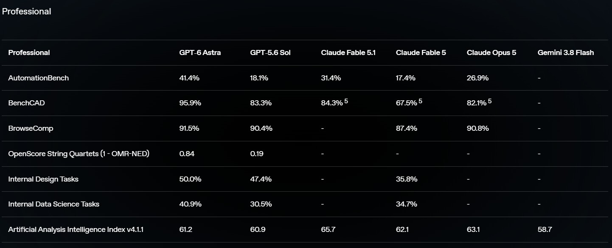
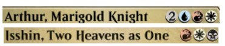
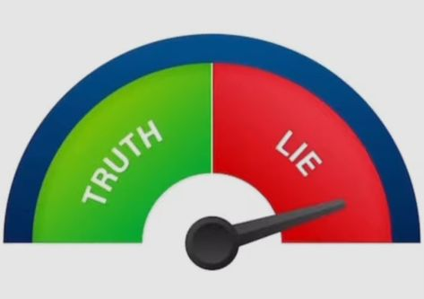
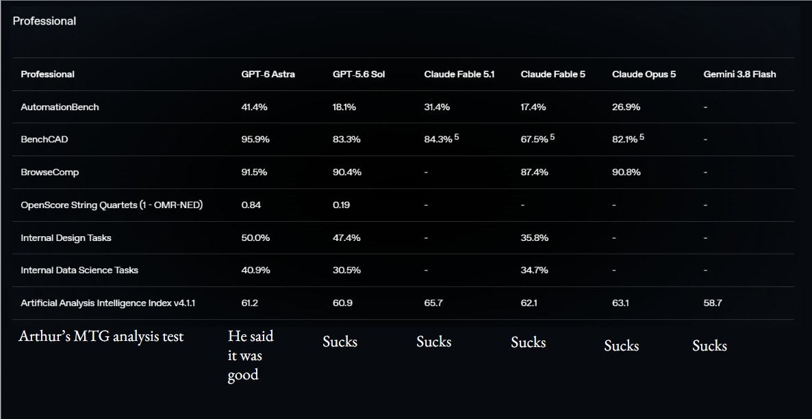

# Judging LLM development with Magic: the Gathering

Before a new model releases, AI companies run it against many different tests like [Humanity's Last Exam](https://lastexam.ai/) and [Terminal Bench](https://github.com/harbor-framework/terminal-bench). These metrics are very useful for turning the subjective words that the model spits out into objective, comparable numbers. It also lets every AI company create a chart full of numbers that shows how their model is better than all of its competitors.

*This is the world's most advanced model, which you can tell because it got higher numbers than all of the other models. It will continue to be the best until a rival releases a new world's most advanced model in 2 days.[^advanced]*

Whenever a new model comes out, I run my own benchmark on it. GPT-6 Astra marks the first time *ever* that I have been satisfied with the output.

## The test

I send the following prompt exactly once and record how factual and helpful the LLM's answer was, with no re-prompting or corrections:

>Perform an analysis of the Magic: the Gathering Commander deck listed below, built for a casual Bracket 3 environment in 4-player games. Consider the following when writing your analysis: 
	- The general game plan of the deck 
	- What the deck excels at and what the deck is weak against 
	- What cards could be great in this deck and should be considered for an addition, and which cards in the 99 are candidates to be cut 
	- What could be done to power up or down the deck(options for both remaining in Bracket 3 and pushing up/down to Bracket 4/2) 
	- Any other concerns regarding the deck construction or playstyle 
Use any necessary resource on the internet to complete this task.
The decklist is provided here: [^decklist]

Unfortunately for the models, this test is exceptionally hard for LLMs due to a number of reasons:  

**Magic is pretty complex**: There are 31,830 cards legal in commander at the time I'm writing this[^date]. That's a lot! Between name, mana cost, type line, rules text, and other faces on a card, each card is roughly 55.6 tokens on average, leading to roughly 1.7 million tokens that you would have to consider when deckbuilding. Magic's rules are also pretty complex, to the point that you need a [312-page document](https://media.wizards.com/2026/downloads/MagicCompRules%2020260807.pdf) to fully hold all of the interactions. 

This is a quantity of data so large that it would immediately exceed the standard context window limit[^context] of 1M. While an LLM doesn't need to keep every card's information in its context, they don't have general heuristics about the game and cardpool in the way that a human player would, and struggle with envisioning deckbuilding as a result.

**Not enough data:** The quality of the output of an LLM is extremely dependent on what inspiration you gave it. The ideal training data for an LLM to learn Magic would be entire games of Magic played and explained. Unfortunately, these just don't exist on the internet in large enough quantities for LLMs to be able to effectively learn. While clients like Arena and MTGO have textual logs, there is no place to see large swaths of game logs[^data]. As a result, LLMs don't have large quantities of data to learn from, and can only really learn about the casual commander play environment from random articles and internet posts about it.

**Games in general aren't very AI-friendly:** Behind all the marketing, LLMs are extremely sophisticated pattern-matching machines; they repeatedly guess what the best next couple characters are, and got very good at doing so. This is great for writing(as words are subjective) and decent for coding(as it can have the compiler point out any mistakes) but a bad fit for a game that carries an exact state and has concrete rules, as well as an extremely large number of possible positions.[^LLMs-and-games] As a result, LLMs "hallucinate" much more often when they are trying to play games. While the model is only performing an analysis of a deck here and not actually playing, deck analysis often requires visualizing realistic game sequences and scenarios that models can only guess with.

**I'm not reprompting or correcting anything:** I chose not to because mistakes and corrections have consequences in the real world, and the option to try again sometimes might not exist. If the model takes three tries to get a good answer on something I know inside out, how can I trust it on something I don’t?

## Fable 5 takes a shot

When Claude Fable 5 released, I gave it this question. This is its response[^markdown], which makes me think it took a shot in a different way. 

Attached are my annotations to it. *Note that a slightly different version of the decklist was used for this prompt.*
|Fable's Response |My Annotation|
|--|--|
|This is a fun one — Arthur is an underplayed commander with a genuinely distinct play pattern. Before the breakdown, one important housekeeping note: **I count only 98 cards in your maindeck**, so with Arthur you're at 99 total instead of 100. Double-check whether a card got dropped when copying the list; if not, you have a free slot (I'll suggest what to put there below).|There are 99 cards + the commander and Fable is just lying|
|**The game plan**    Arthur, Marigold Knight is a 5-mana Jeskai 4/5 with haste whose trigger reads: whenever Arthur and at least one other creature attack, look at the top six cards of your library, put a creature card from among them onto the battlefield tapped and attacking, then return that creature to its owner's hand at end of combat. Your deck is built to do three things with that:|Fable 5 shows it can at least read cards, so it's at least better than many Commander players|
|1. **Cheat out haymakers mid-combat.** Moonshaker Cavalry, Ancient Gold Dragon, Elesh Norn, Highcliff Felidar, Curious Colossus, Angel of Serenity, Moonshaker especially — a surprise white Craterhoof off the top can simply end someone. Curious Colossus is a particularly nasty hit: when it enters, each creature a target opponent controls loses all abilities, becomes a Coward, and has base power and toughness 1/1 — and the effect is permanent.|True|
|2. **Break the "return it to hand" clause with blink.** Ephemerate, Cloudshift, Momentary Blink, Soulherder, Phelia, Brago, and The Neutrinos all exile-and-return the cheated creature, making it a new object that Arthur's delayed trigger can no longer find — so you keep it forever *and* get its ETB again. The Neutrinos is a dedicated enabler here: whenever it attacks, you exile up to one target creature you own, then return it to the battlefield under your control tapped and attacking. Skycoach Conductor is the same idea on a stick — it's a flash flyer that enters prepared with All Aboard, a {U} instant that exiles a target non-Pilot creature you control and returns it immediately.|Soulherder, Phelia, and the Neutrinos don't actually work like this due to a slightly unintuitive rules interaction.[^rules]|
|3. **Profit even when the creature bounces.** Cards like Anticausal Vestige are designed to leave: when it leaves the battlefield, you draw a card and may put a permanent with mana value up to your land count from your hand onto the battlefield tapped. Angel of Serenity, Riptide Gearhulk, Lord of Change, Aether Channeler, and friends are happy to be recast from hand. Starwinder turns all this combat into fuel: whenever a creature you control deals combat damage to a player, you may draw that many cards.|Starwinder has nothing to do with the rest of the paragraph?|
|Gogo and Irma support the "Arthur needs a second attacker" requirement while copying whatever fatty you've managed to keep — Gogo becomes a copy of another creature you control at the beginning of combat, giving both +2/+0 and haste.   Two rules points every Arthur pilot should internalize:   - Creatures Arthur puts in **were never declared as attackers**, so their own "whenever this attacks" abilities don't trigger. ETB triggers and combat damage triggers (Medomai, Ancient Gold Dragon, Starwinder) work fine — build and play around this.   - **Timing your blinks:** combat damage happens *before* the end of combat step. So let the cheated creature connect, then Ephemerate/All Aboard it during the combat damage or end of combat step — you get the damage, the ETB, and you keep the body. Note that Thassa, Deep-Dwelling blinks at the *end step*, which is too late to save an Arthur hit; she's there for general ETB value only.|Critically fails to mention that Gogo and Irma can copy Arthur, which is almost always a disgusting play.    Also, correctly calling out that Thassa doesn't work to blink cheated creatures is a bit weird because Soulherder does the exact same thing but Fable said the opposite|
|**What the deck excels at**    It's a genuine "something for nothing" combat deck with a control shell. You generate 6 cards of selection every attack, your threats demand answers at instant speed, and you hold up an excellent counter suite (Counterspell, Mana Drain, Fierce Guardianship, Dovin's Veto, Three Steps Ahead) plus cheap white removal. The catch-up land package (Knight of the White Orchid, Loyal Warhound, Claim Jumper, Deep Gnome Terramancer) means you punch up well against faster tables, and your sweepers — Time Wipe, Vanquish the Horde, and Avatar's Wrath, which airbends all creatures except one and stops opponents from casting spells from anywhere other than their hands until your next turn — let you reset boards you're losing. With exactly two Game Changers (Fierce Guardianship and Mana Drain), you're squarely and legitimately Bracket 3; for reference, including even one Game Changer makes a deck Bracket 3 or higher under the current system.|Mana Drain isn't a Game Changer. This error surprised me because checking if a card is on the Game Changer list is an extremely simple task.|
|**What it's weak against**  - **Commander dependency.** Without Arthur connecting, this is a pile of overcosted creatures and reactive spells. A table that kills Arthur on sight (or holds up removal for your attack step) drains you fast, and you run almost zero dedicated protection beyond counterspells. - **Combat hate.** Propaganda/Ghostly Prison effects, fog effects, deathtouch walls, and instant-speed removal aimed at the *cheated* creature (killing it before damage wastes your whole trigger) all blank the plan.|Commander dependency is debatable because the deck does better than most if  everyone loses access to their commander. Also, Arthur has haste and generates a trigger the turn he is cast, and due to the 4-player dynamic it is unlikely people hold instant-speed removal.   Fable also doesn't recognize here that Arthur only needs to be able to attack 1 opponent to cause problems, and you have 3 possible targets.|
|- **Your own tax pieces.** This is the biggest internal problem: Eidolon of Rhetoric, Ethersworn Canonist, and Archon of Emeria all restrict *you* too. This deck desperately wants to double-spell — cast a creature, hold Ephemerate and a counterspell — and a one-spell-per-turn lockdown handcuffs you more than it hurts a typical Bracket 3 opponent. Keep at most one (Archon, whose land clause is asymmetric), unless your meta is full of spellslingers.|The deck is much better at playing through one-spell-per-turn effects than others, and doesn't really want to double-spell. It also often can't if playing large creatures, which Arthur guarantees will end up in your hand.    Fable also doesn't see the nasty synergy between counterspells and one-spell-per-turn effects|
|- **Whiffy triggers.** Hitting Cartographer's Hawk or Sand Scout with Arthur's dig when you needed a threat feels terrible. Every small utility creature dilutes the trigger. |Hitting a ramp creature is bad, but changing the ramp out for threats is worse and burdens an already sluggish deck. No other change actually helps this, as if you see both a ramp creature and a threat in the 6 cards you would just choose the threat and not have this problem.|
|- **Slow ramp.** Four rocks plus conditional land-fetchers (which are dead draws when you're ahead) means Arthur often lands turn 5 and swings turn 6 in a deck with a high curve.|The deck had 10 ramp pieces because it tries to run as many creature-based ramp options as it can, so Arthur usually comes down on turn 4.5 on average. Arthur also has haste so if he lands on turn 5 he will also swing on turn 5, not turn 6.|
|**Suggested additions**  - **Isshin, Two Heavens as One** — in your colors, and it doubles Arthur's attack trigger: two free creatures per swing. This would be my pick for your open 99th slot. |"In your colors" Fable do these look the same to you?   |
|- **Roaming Throne** (naming Knight) — same effect, colorless, blink-friendly. - **Protection:** Akroma's Will (protection *and* a finisher), Flawless Maneuver, Lightning Greaves or Swiftfoot Boots. Arthur eats removal; you need more than counterspells. - **Extra combats:** Port Razer or Aurelia, the Warleader — each new combat is a fresh Arthur dig, which scales your whole deck. - **Restoration Angel / Essence Flux** — more instant-speed blink to keep Arthur hits; you currently have fewer "keep it" effects than you'd like to see per game. - **Sun Titan** — great Arthur hit that rebuys Soulherder, Skyclave, Phelia, and your MDFC lands. - **Reconnaissance Mission / Bident of Thassa** — combat-damage draw that doesn't need to survive combat like Starwinder does.|Fable doesn't grasp that there's an opportunity cost to all of these cards and focuses on the upside. Every noncreature protection spell or value spell dilutes the creature count and makes Arthur's trigger less consistent.    Sun Titan is also not very good here because its closer to a defensive card that doesn't help the offensive gameplan of putting massive threats on the battlefield.    Roaming throne is an okay addition but it is substantially worse than the other two existing copy effects.|
|**Cut candidates**  - **Eidolon of Rhetoric** (and probably **Ethersworn Canonist**) — the anti-synergy discussed above.|Mistake explained above. One-spell-per-turn effects help slow down such a broad swath of decks that neutering some uncommon play-lines is a very acceptable cost.|
|**Cartographer's Hawk** — gives the opponent a land back, and is a miserable Arthur hit.|That's not what Cartographer's Hawk does|
|**Sand Scout** — its ETB only fetches a Desert, and you run just three (Eroded Canyon, Mirage Mesa, Scavenger Grounds); it's usually a vanilla 2/2.|Fable's point is nonsensical because Sand Scout searches your entire library, so you only need 1 or 2 deserts in your deck to get the effect.|
|- **Vedalken Plotter** — cute politics, low impact. - **Astral Dragon** — 8 mana to copy a *noncreature* permanent, and your own noncreature targets are signets and lands. It looks like a bomb but rarely is one here. - **Medomai the Ageless** — fine power-wise, but extra turns are the single fastest way to get a Bracket 3 table salty at you; a judgment call.|Actually correct; all three of these cards were later cut for better ones. Fable does miss that Vedalken Plotter can steal bouncelands to ramp you though.|
|**Tuning the power level**   **Up toward Bracket 4:** add more Game Changers (Rhystic Study, Mystic Remora, Cyclonic Rift, Smothering Tithe), faster mana, and a compact backup win like Deadeye Navigator + Peregrine Drake for infinite mana into infinite blinks (Deadeye is already in the deck — be aware that adding the Drake quietly turns your value engine into a combo deck, which changes the conversation you owe your pod). Tighten the curve, cut the cute copy effects, and add free protection. **Down toward Bracket 2:** cut Mana Drain and Fierce Guardianship for Negate/Arcane Denial (zero Game Changers is the hard requirement), drop Medomai and the tax creatures, swap Tundra for a budget dual, and lean into the flickering-fairytale theme with more midrange ETB creatures. The deck honestly loses very little fun this way — the Arthur engine is the fun part, and it's bracket-agnostic.| I don't have any feedback on the Bracket 4 advice because I don't have any experience there.    The Bracket 2 advice would technically make a Bracket 2-legal deck but it would be miserable to play against. Fable should have recommended to decrease the creature quality.     |
|**Other construction notes**   - **Emeritus of Truce // Swords to Plowshares alongside the real Swords to Plowshares is legal** — per the new preparation-card rulings, a preparation card is a creature card in every zone, so it's a creature named Emeritus of Truce for deck-construction purposes, not a second StP. The mechanic is brand new (April 2026), though, so expect to explain this at the table. Bonus synergy: it re-prepares on each ETB if an opponent has more creatures than you, so blinking it reloads your removal.||
|**Path of Ancestry** rarely scries for you — Arthur is a Mouse Knight and almost nothing in the 99 shares a type. It's just a tapped Triome here; Jeskai has better options (e.g., a fourth untapped dual or Spara-style triome).|Jeskai doesn't have better options, and the "Spara-style triome" is already in the deck. You can tell because Fable just said there were better options and didn't actually say what they were.|
|**38 lands + 3 MDFC spell-lands is on the high side** for a deck with four rocks and a 5-drop commander — reasonable, but if you make cuts, a land is a fine place to find a slot. Abstergo Entertainment is fine as a flavor pick with a real late-game ability (it can recur a historic card and exile all graveyards), but it's also the first land to trim if you're ever color-screwed, since it produces colored mana only at a premium.|No it isn't; 38 is generally the agreed-upon average, and many decks run upwards of 40. Fable also fails to count creature-based catchup ramp alongside mana rocks, likely because less decks use them and LLMs focus on the popular things.|
|**Playstyle tip:** sequence your attack triggers so The Neutrinos/Phelia exile targets are chosen *after* you see what Arthur reveals, and always announce clearly which creature came in via Arthur — the tapped-and-attacking-but-never-declared-attacker status trips up a lot of tables.  Overall this is a coherent, flavorful Bracket 3 deck with one real construction bug (the missing card), one internal contradiction (the spell-tax package), and a clear upgrade path. Fix those and add a doubler like Isshin, and it'll punch noticeably harder without leaving the bracket.|You can't do that playstyle tip because it's not allowed in the rules.|
---
Fable also doesn't touch on a couple of things:
- The list it analyzed had 0 ways to gain life, which leads to the deck being worn down very quickly. This is because the deck has a hard time advancing its gameplan and also holding blockers. The early-game creatures have mediocre statlines, and Arthur needs to attack to get value, which results in taking many chip shots before being able to put down creatures that can block. As a result, even though you start with 40 life in commander, the deck often had 25 or less when making big plays.
- The exclusion of Sol Ring and all lands that shuffle your library was intentional but I didn't tell Fable this. Fable understood fetchlands as a reasonable mana upgrade but didn't comment on the rest of this.
- The deck's manabase is sometimes shaky, due to needing 3 colors of mana and playing many lands that enter tapped to do so, sometimes leading to slower plays.
- The Neutrinos and Medomai the Ageless is a 2-card combo for infinite extra turns, which is problematic and should have been flagged due to the Bracket 3 guidelines. It was removed from the decklist between this test and the next.
- Reliance on interaction tied to enters-the-battlefield abilities means that the deck has very few ways to answer effects that shut off these abilities.
- Many expensive cards can get stranded in hand because Arthur's trigger puts one into your hand every attack, some of which even have to be discarded to hand size.

Overall, this is a poor performance, but not particularly out of my expectations. I commonly say that LLMs are bad at Magic due to the problems listed above, and it seems that Fable doesn't particularly break the mold here. AI is generally good at talking about Magic(and other games) generally, because that's where it can make generic statements and default to popular thinking paths[^popularity]. However, when specific card text or rules interactions are required to make factual statements, Fable fumbled in many different ways, and those mistakes ended up compounding(because it took this mistake as true information when generating more tokens) to make the analysis actively misleading.

## GPT-6 Astra takes a shot

GPT-6 Astra has released very recently[^current] and I decided to run this experiment there as well:

|Astra's response|My annotation|
|--|--|
|**This is a coherent Bracket 3 deck with a strong late game and a potentially oppressive control plan.** Arthur supplies temporary access to expensive creatures; blink effects convert their abilities into repeatable value; and your spell-limit creatures slow opponents while Arthur bypasses casting restrictions. I would improve the deck’s consistency and combat safety before adding more expensive threats.  Its main risks are repeated removal of Arthur, effects that shut off creatures entering, and hands full of expensive cards without a functioning engine. There is also a meaningful difference between its bracket classification and its table experience: repeated creature suppression can feel much harsher than its single Game Changer suggests.|True statements.  It's impressive for a model to be able to reason its way to the table experience comment from just the decklist.[^reasoning]|
| **Bracket fit and construction** The list contains exactly 99 cards plus Arthur, with no color-identity or Commander-legality problems found. Your relevant counts are:|(This was a table in the original response, but you can't put a markdown table inside another markdown table)|
| **Component:** Dedicated lands **Count:** 38 **Assessment:** Sensible for a five-mana commander and substantial top end |True|
| **Component:** Additional land/spell cards **Count:** 3 **Assessment:** Hydroelectric Specimen, Sink into Stupor, Witch Enchanter | |
| **Component:** Creatures in the 99 **Count:** 43 **Assessment:** Excellent Arthur hit density | Hitting a creature like Sand Scout or Soulherder isn't good because their bad stats mean they are unlikely to survive the combat, so "hit density" should be examined further. This would probably be better as two categories: expensive creatures that Arthur would like to hit and cheap creatures that Arthur can attack alongside.|
| **Component:** Creatures costing six or more **Count:** 15 **Assessment:** Powerful hits, but a substantial burden when drawn |Counting the amount of each card category is a great method of analysis; the model actually goes further and does probability tests later. This is especially useful for this category, because whiffing Arthur triggers is very bad.|
| **Component:** Two-mana mana rocks **Count:** 5 **Assessment:** Includes **The Mind Stone**, distinct from ordinary Mind Stone |Also doesn't count "catchup ramp" effects as ramp. The assessment is very undescriptive though.|
| **Component:** Current Game Changers **Count:** 1 **Assessment:** Fierce Guardianship | |
| Bracket 3 permits up to three Game Changers. **Mana Drain, Elesh Norn, Grand Cenobite, and Deadeye Navigator are not currently on that list.** The broader expectation matters too: Bracket 3 generally allows players six turns to develop before someone wins or loses, whereas Bracket 2 expects eight and Bracket 4 four. These are matchmaking expectations, not a rule that you should hold an otherwise consistent early win until later. [Official bracket guidance](https://magic.wizards.com/en/news/announcements/commander-brackets-beta-update-october-21-2025), [current Commander framework](https://magic.wizards.com/en/formats/commander). ||
| I would describe this deck before a game as **“Arthur combat/blink with three spell-limit creatures and repeatable creature control.”** That communicates more than “Bracket 3, one Game Changer.” | I usually describe it as "Flicker Sneak-and-Show Control" but everybody communicates differently|
| **How the deck wants to play**    The early turns establish mana and an attack partner. Knight of the White Orchid, Sand Scout, Deep Gnome Terramancer, and the other inexpensive creatures are particularly useful because they contribute resources without sacrificing Arthur’s creature density. | This is a great descriptor of turns 1-4 in this deck; play a creature and maybe a ramp spell and wait.|
| Arthur then attacks alongside another creature and selects a creature from the top six cards. The creature enters attacking, generates immediate value, and normally returns to hand at the end of combat. You can choose a different defending player for that creature, which helps find an opening across three opponents. [Arthur’s official release notes](https://media.wizards.com/2024/downloads/BLB_Release_Notes_DgtOCtpFAl/EN_BLB%20Release%20Notes%2020240611.pdf). |The shoutout of being able to choose different defending players for the creature is very important to the deck|
| Your hits serve several complementary purposes: **Control:** Riptide Gearhulk, Highcliff Felidar, Curious Colossus, Angel of the Ruins, and Angel of Serenity. **Resources:** Lord of Change, Starwinder, Beza, and Anticausal Vestige. **Closing the game:** Ancient Gold Dragon builds an army; Moonshaker Cavalry converts a board into lethal combat; Terror of the Peaks turns repeated creature entries into direct damage. | |
| At the starting deck composition, an unconditioned six-card sample contains at least one creature about **97%** of the time, and at least one of your fifteen six-plus-mana creatures about **64%** of the time. Actual odds change with cards drawn and removed, but the implication is clear: **Arthur does not need more creatures simply to avoid missing. He needs opportunities to attack and useful choices among his hits.** |In the process of refining this deck I actually used a hypergeometric calculator in this way, to see how often a hand would find a creature to play before Arthur, and how many |
| Gogo and Irma are especially good inclusions. Copying Arthur before attacks can produce multiple Arthur triggers without losing either creature to the legend rule. They are engine multipliers, not merely extra large creatures. However, becoming a copy does not trigger an enters ability, and they cannot copy a creature Arthur has not put onto the battlefield yet. [Gogo](https://scryfall.com/card/fic/56/gogo-mysterious-mime), [Irma](https://scryfall.com/search?q=%21%22Irma%2C+Part-Time+Mutant%22). | Hits the primary purpose but misses the secondary purpose of shortening the window of time in which other threats can be answered by being able to give them Haste(Gogo) or copy them and attack(Irma)|
| **The timing details materially affect this deck** Several cards look interchangeable as “blink support” but perform different jobs: |Being able to distinguish all of these is impressive|
| **Card or effect:** Cloudshift, Ephemerate, Momentary Blink **Can it keep the creature Arthur just found?:** Yes, if used before Arthur’s return trigger resolves | |
| **Card or effect:** Deadeye Navigator **Can it keep the creature Arthur just found?:** Yes, with the appropriate soulbond pairing and available mana |Misses that Deadeye Navigator can also flicker itself to keep itself|
| **Card or effect:** Brago **Can it keep the creature Arthur just found?:** Yes, if Brago connects and blinks the creature | |
| **Card or effect:** Soulherder, Thassa, harnessed The Mind Stone **Can it keep the creature Arthur just found?:** Their normal end-step triggers are too late | |
| **Card or effect:** Phelia or The Mighty Thor attacking alongside Arthur **Can it keep the creature Arthur just found?:** Cannot target the incoming hit: their targets are chosen before Arthur’s trigger resolves | |
| Blinking makes the returned creature a new object, so Arthur’s delayed trigger cannot return that new object. If the creature can survive combat, you can let it deal damage and then blink it before the return trigger resolves. Blinking it before damage removes it from combat.   Soulherder, Thassa, and The Mind Stone remain useful engines for creatures already established on the battlefield. They simply do not independently solve Arthur’s end-of-combat return.   Similarly, **entering attacking does not trigger “whenever this creature attacks” abilities**. Thor and Phelia are therefore better established before combat than discovered by Arthur. Their attack triggers can still remove blockers or reuse an existing value creature. | Many models seem to be able to understand this part of the rules, so GPT being able to is not surprising.|
| Skycoach Conductor is a useful creature-based source of a blink spell, but All Aboard is still **cast**, and it cannot target a Pilot—including the Conductor itself. [Skycoach Conductor rules](https://mtg.wtf/card/sos/67a/Skycoach-Conductor). | |
| **What the deck excels at**  **Multiplayer resource exchanges.** Highcliff Felidar and Riptide Gearhulk can affect all three opponents from one creature entry. Repeating those effects gives you a much better exchange rate than repeatedly trading one removal spell for one opposing threat. **Creature-heavy matchups.** Elesh Norn devastates small creatures, Curious Colossus disables an established board, and your bounce, exile, and destruction effects cover different kinds of protection. Curious Colossus’s effect lasts indefinitely on the creatures it affected—even after the Colossus leaves. That makes it particularly strong against commanders that opponents would prefer to leave on the battlefield. [Curious Colossus and rulings](https://scryfall.com/card/ecl/12/curious-colossus). **Playing through your own spell limits.** Arthur’s ability, Brago’s trigger, and Deadeye’s activation are not spells. Archon of Emeria, Eidolon of Rhetoric, and Ethersworn Canonist can therefore constrain opponents more than you, particularly against decks that chain several spells together. **Threat diversity.** You can win through an army, oversized combat damage, or Terror of the Peaks. Your graveyard interaction is also unusually well represented through Lion Sash, Scavenger Grounds, and Abstergo. |This is a really good summary of the deck's strengths. I built the deck to prey on the creature-heavy stereotypical commander deck and have an abundance of interaction, and GPT seems to have understood it very well here.|
| **Where the deck is vulnerable**  **Arthur being repeatedly answered.** Five mana is manageable; seven or nine becomes difficult while maintaining protection. Several white ramp creatures stop accelerating once you catch up on lands, so eleven nominal ramp pieces do not all behave like unconditional mana sources. **Combat restrictions.** Arthur has haste but no built-in evasion or protection. Large blockers, deathtouch creatures, attack taxes, and repeated removal of your second attacker can interrupt the engine. Four players offer more attack destinations, but also more interaction. |Very true points|
| **Effects that shut off creature entries.** Torpor Orb and Hushbringer disable much of your value package. Containment Priest is worse: it can exile Arthur’s incoming creature or a creature you attempt to blink. Much of your artifact/enchantment removal itself relies on enters triggers, so retaining some answers that function without those triggers is important. [Torpor Orb](https://scryfall.com/search?q=%21%22Torpor+Orb%22), [Containment Priest](https://scryfall.com/search?q=%21%22Containment+Priest%22). | Very good note that I didn't pick up at first until I playtested it, my opponent played Elesh Norn, Mother of Machines, and I discovered that there were only 2 non-counterspell answers in the 99-card deck for it.|
| **Your own casting restrictions.** With Archon or Eidolon out, casting Arthur uses your spell for the turn. You then cannot cast Ephemerate, All Aboard, or even a free Fierce Guardianship that turn. Ephemerate’s rebound can consume the following turn’s spell as well. Canonist creates a similar problem for nonartifact spells. | I discovered this in playtesting but casting Arthur usually uses all of the deck's mana for the turn anyways|
| **Slow recovery after a reset.** Your strongest draw effects generally require considerable mana, combat, or Arthur. A little more affordable creature-based draw would help rebuild without waiting for those engines. | This is a real weakness, but closer to having many expensive threats in hand and no time to play them rather than not having the cards.
| **Additions and cuts I would prioritize**   These changes improve the existing plan without deliberately introducing a fast combo strategy. ||
| **Consider adding:** **Scroll Rack** **Candidate cut:** Resolute Archangel **Reason:** Puts expensive creatures from hand back on top for Arthur and exchanges awkward cards for fresh options |Scroll rack is very popular among decks with this commander; I have never tried it because Scroll Rack's inclusion dilutes creature quantity, so I don't know if its good or not|
| **Consider adding:** **Reconnaissance** **Candidate cut:** Realm-Cloaked Giant **Reason:** Makes Arthur and his companion much safer attackers; you already have extensive creature control | Questionable change|
| **Consider adding:** **Touch the Spirit Realm** **Candidate cut:** Momentary Blink **Reason:** Its channel ability can preserve an Arthur hit without casting a spell; the enchantment mode provides additional interaction |Actually really good change that I would make, this card has many different modes that provide the role compression the deck is looking for|
| **Consider adding:** **Abuelo, Ancestral Echo** **Candidate cut:** Deadeye Navigator **Reason:** Lower-cost flying attack partner with an activated blink ability; trades Deadeye’s ceiling for earlier usability |I considered it when building but this card kinda sucks|
| **Consider adding:** **Mulldrifter** **Candidate cut:** Disdainful Stroke, if your pod permits less countermagic **Reason:** Affordable draw when needed, an Arthur hit, and a reusable blink target  **Consider adding:** **Talisman of Creativity** **Candidate cut:** Cartographer’s Hawk **Reason:** Unconditional acceleration and fixing without needing a successful attack against a player ahead on lands | These cards were both in earlier versions of the deck but were cut after playtesting; the deck doesn't need a ton of draw and wants to run as many creatures as possible|
| A few qualifications matter: | |
| **Reconnaissance does not cancel Arthur’s return trigger.** It protects attackers and can untap surviving attackers after damage while combat is still ongoing. | |
| **Deadeye is not a bad card here.** Keep it over Abuelo if your games regularly reach the stage where repeated two-mana blinks dominate. | |
| **Resolute Archangel is a metagame slot.** It is excellent against ordinary damage races, but does little against commander damage or non-damage wins. | |
| **Realm-Cloaked Giant is useful flexibility**, but its creature face is a relatively poor Arthur hit. Its Adventure also destroys most of your own board. | |
| **Disdainful Stroke is good against expensive commanders and spells.** If that describes your opponents, find the draw slot elsewhere. | |
| Other worthwhile options are **Spirited Companion** for early draw plus an attack partner, **Iroas, God of Victory** for combat safety, and **Sol Ring** if its omission was not intentional. I prefer Companion over Wall of Omens here because it can accompany Arthur in an ordinary attack. |Notices the Sol Ring omission very helpfully|
| I would preserve **Starwinder, Anticausal Vestige, Gogo, and Irma**. They address core engine needs. Vestige is particularly well suited to Arthur: returning it to hand triggers its leaves ability, generating value even when you do not keep it. ||
| **Mana-base changes**  The quantity is reasonable; the bigger issue is speed. Nine lands always enter tapped, with several others conditionally doing so. That can prevent the crucial sequence of casting Arthur while retaining mana for an ability or interaction.  I would replace **Mystic Monastery** and **Path of Ancestry** first. Arthur is a Mouse Knight, and relatively few of your creatures share either type; being put onto the battlefield by Arthur does not trigger Path’s casting-based scry.  Flooded Strand, Arid Mesa, and Scalding Tarn are strong replacements if budget permits. Your typed dual lands give them excellent coverage, and they also support Sand Scout’s land-to-graveyard trigger.  I would not automatically cut the Desert package: Sand Scout gives Eroded Canyon, Mirage Mesa, and Scavenger Grounds a real purpose. Your Plains-searching package also has **twelve Plains-typed lands**, counting the six basics. Remember that Loyal Warhound specifically requires a **basic** Plains.  | These are all good points; the lack of fetchlands was deliberate|
| **How I would adjust the power level** | I have no complaints about this entire section; the model suggests good, sound ideas for all of it|
| **Direction:** **Stronger within Bracket 3** **Changes I would make:** Prioritize Scroll Rack, Reconnaissance, better untapped mana, and dependable ramp. Keep strong multiplayer enters effects. Add activated/channel interaction that works under your spell limits. | |
| **Direction:** **Gentler within Bracket 3** **Changes I would make:** Remove Eidolon and Canonist, possibly Archon too. Replace them with draw/value creatures. Reduce repeated Curious Colossus or Elesh Norn suppression while keeping enough finishers to end games. | |
| **Direction:** **Toward Bracket 4** **Changes I would make:** Add faster mana, efficient tutors/protection, and a deliberate compact win package. Cut several seven-mana value creatures and conditional ramp cards to make room. | |
| **Direction:** **Toward Bracket 2** **Changes I would make:** Remove Fierce Guardianship, reduce the spell-limit package and repeated board suppression, and favor visible creature development followed by ordinary combat wins. | |
| For **stronger Bracket 3**, you have room for two more Game Changers, but filling those slots is optional. Teferi’s Protection would address resilience; Rhystic Study would improve draw, though your spell limits reduce how many opportunities it receives. Neither removes the need to respect the deck’s actual speed and play experience. | |
| For **Bracket 4**, a concrete route is **Peregrine Drake plus Deadeye Navigator**. With lands producing more than the two mana needed per blink, the pair generates unlimited mana; an available Aether Channeler can draw through the deck, and Terror of the Peaks can convert repeated entries into lethal damage. That is a substantial strategic change, even though neither combo piece is itself a Game Changer. [Peregrine Drake](https://scryfall.com/card/dmr/65/peregrine-drake), [Deadeye Navigator](https://scryfall.com/card/inr/59/deadeye-navigator). | |
| Ancient Tomb, Mana Vault, and appropriate tutors then improve speed and consistency. Simply adding expensive staples without restructuring the curve would produce a more expensive deck, not necessarily a convincing Bracket 4 deck. | |
| For **Bracket 2**, replacing Fierce Guardianship with Negate satisfies the Game Changer issue, but does not by itself change how the deck feels. I would also remove the three spell-limit creatures and consider replacing Curious Colossus, Elesh Norn, and Deadeye with cards such as Cloudblazer, Solemn Simulacrum, and Charming Prince. Keep the mana functional; lower the pressure and repeatability of the strongest effects instead. |Good callout that the deck packs way too much removal for a Bracket 2 environment.|
| **My first changes would be Scroll Rack, Reconnaissance, and Touch the Spirit Realm.** They directly address expensive cards stranded in hand, unsafe attacks, and blink spells conflicting with your own restrictions. From there, decide whether the table enjoys the spell-limit plan: it is both the deck’s strongest strategic distinction and its largest source of potentially frustrating games. | |

Even though there are some disagreements, this is an incredibly good answer. GPT-6 understood the core gameplan of the deck in a nuanced way and was able to predict many different things that I actually encountered in my playtesting and refinement. Nearly every point that I disagreed with it on could easily have been a matter of opinion and/or local meta. Astra even goes over a majority of the points that Fable missed.

## So they finally made AGI and the Age of Abundance is coming to my door in 5 seconds, right?

*I can't play audio in this writeup but if I could I would play [this](https://www.youtube.com/watch?v=6Rt7NnRcNEM).*

This test obviously has its limits. It's one prompt on one deck, run once and graded subjectively with significant bias. It definitely doesn't have a place on the same charts that model releases use.

*Claude Mythos 6 will boast a rating of "He said it was pretty great" when it comes out in 3 months.*

Instead, it's a measure that I can trust because I know Magic very well. LLMs love to make up things and pass them off as real, and in order to be able to fact-check it you need to know the subject extensively. Everyone should have one of these, instead of taking model release articles' numbers at face value. Mine just uses 99 cards and a mouse that shares my name.

But the gap between those two responses is the most interesting result I've encountered so far. LLMs have been able to read online resources and check what the cards in the decklist do for a long time. Fable 5, the groundbreaking model of three months ago, as well as every other model in the past I tried this with, still returned with an analysis riddled with factual errors. In my eyes, Fable was no different from Opus or GPT-5; just another model returning 70% correct slop.

Astra, the groundbreaking model of today, made almost none of the same mistakes. It counted card categories, ran hypergeometric math on the commander's hit rate, sorted the blink effects by which ones actually beat the end-of-combat return trigger, and independently arrived at conclusions I only reached after many games of playtesting. Where I disagreed with it, I was mostly disagreeing about opinion or local meta, which is the same way I disagree with people. *This level of analysis could easily have come from handing the decklist to a friend.*

But more notably, none of the three problems for LLMs I outlined have changed between Fable's release and Astra's. LLMs still suck at games, Magic is still complicated, and there's still no good data. The only reason Astra did well was because it could substitute experience with the game with massive bursts of reasoning. But if it can take this approach and make something that rivals a human in an excessively hostile environment for LLMs, then what else can it do?

Maybe with enough engineering, they might even be able to hold their own in an actual Magic game.

...Hopefully it doesn't end up like that.

[^advanced]: This actually happened, by the way. On 9/1/2026 Fable 5.1 was released, on 9/2 Muse Spark 1.3 released, and on 9/3 GPT-6 Astra released. I imagine every AI company is holding onto their new model in a game of PR chicken to see which company can get the last word with "Our model is better than yours!".
[^decklist]: I omitted the decklist in the article so you wouldn't have to scroll through 90 lines of cards. It's [here](https://pastebin.com/fyP6iCma).
[^date]: For reference HOB(The Hobbit set) has just released. Go [here](total_tokens.py) if you want to see how many tokens it would take if this is outdated and WOTC has released Universes Beyond GTA 6 or something.
[^context]: This is made worse by the fact that excessive context in an LLM often leads to degrading quality regardless of how large the advertised context window is. [This blog](https://www.elvex.com/blog/context-length-comparison-ai-models-2026) estimates that the effective context cap before responses come worse is 60-70% of the advertised maximum. If you want to research this more, this is called context rot.
[^LLMs-and-games]: Asking early LLMs to play Chess was possibly the most popular example of this. Most of the time, the model would throw out some legal moves(because its training data contained many of the same starts to a chess game) but then will devolve into illegal moves extremely quickly, because the game state has not been reached enough times before for the LLM's pattern-matching to make sense. Later LLMs don't do this, but instead play very poorly and lose pieces at a rate that makes even me think I'm alright in comparison. 
[^markdown]: I have edited the response slightly because some markdown elements break in tables.
[^rules]: This is because Phelia and The Neutrinos must target their ability when its put on the stack. Arthur can only put a creature on the battlefield when his ability resolves, which means that the cheated creature is not on the battlefield when the flicker-creatures need to choose their target. Soulherder doesn't work because it flickers on the end step, which is too late to stop the creature from returning itself at end of combat.
[^current]: This analysis was made on September 4, 2026, one day after GPT 6 released.
[^reasoning]: The line of thought required to get here is very complicated in my eyes. The model to go from "The deck has many creatures with devastating, creature-neutralizing abilities" -> "The deck has several ways to re-use the abilities, leading to commonly harsh board suppression in the midgame" -> "Most Commander decks are creature-heavy" -> "The deck can feel oppressive when it hits its stride in the average Bracket 3 environment" without being able to playtest or simulate anything. This point also hits harder because I felt it in actual games, and my playgroup even somewhat adapted to run more interaction.
[^popularity]: LLMs commonly recommend things that are popular because that's what machine learning generally ends up with. In this case, models love to recommend cards that are *popular* instead of cards that are *good*.